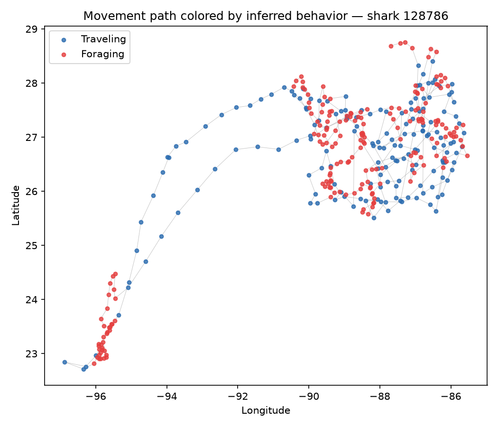
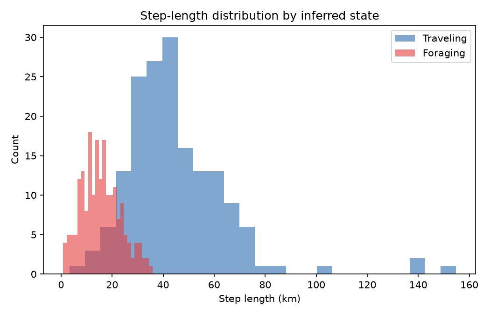

# Whale Shark Movement State Classification (HMM)

## What this is
A Hidden Markov Model classifying a whale shark's GPS tracking data into
"traveling" vs. "foraging" behavioral states, based purely on movement
statistics — no external behavioral labels are used; the model discovers
the two states entirely from the structure of the data.

## Data
Source: [Movebank.org](https://www.movebank.org), study "Whale shark
movements in Gulf of Mexico" (CC BY license). Shark ID 128786, 367 raw
GPS fixes (365 used in the final model, after computing step-length and
turning-angle metrics, which drops the final point in the track), spanning
2009–2015.

## Method
For each consecutive pair of GPS fixes, computed:
- Step length (haversine distance between points, in km)
- Turning angle (change in bearing between consecutive steps, in radians)

Fit a 2-state Gaussian HMM (`hmmlearn`) on these two features to classify
each step into a behavioral state. States were labeled post-hoc: the state
with the larger mean step length was called "Traveling," the other
"Foraging."

## Key result
This shark spent approximately 54.0% of tracked time in a "foraging"
state and 46.0% in a "traveling" state. The two states are clearly
statistically distinct — mean step length was 15.6 km for foraging vs.
44.8 km for traveling, roughly a 3x difference.



The map shows this separation is also spatially coherent: foraging
(red) points cluster tightly within a specific region, while traveling
(blue) points trace a clear directed path — consistent with genuine
area-restricted search behavior rather than an arbitrary statistical split.



## How to run

```bash
pip install -r requirements.txt
jupyter notebook analysis.ipynb
```
